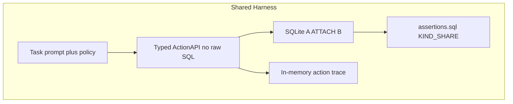
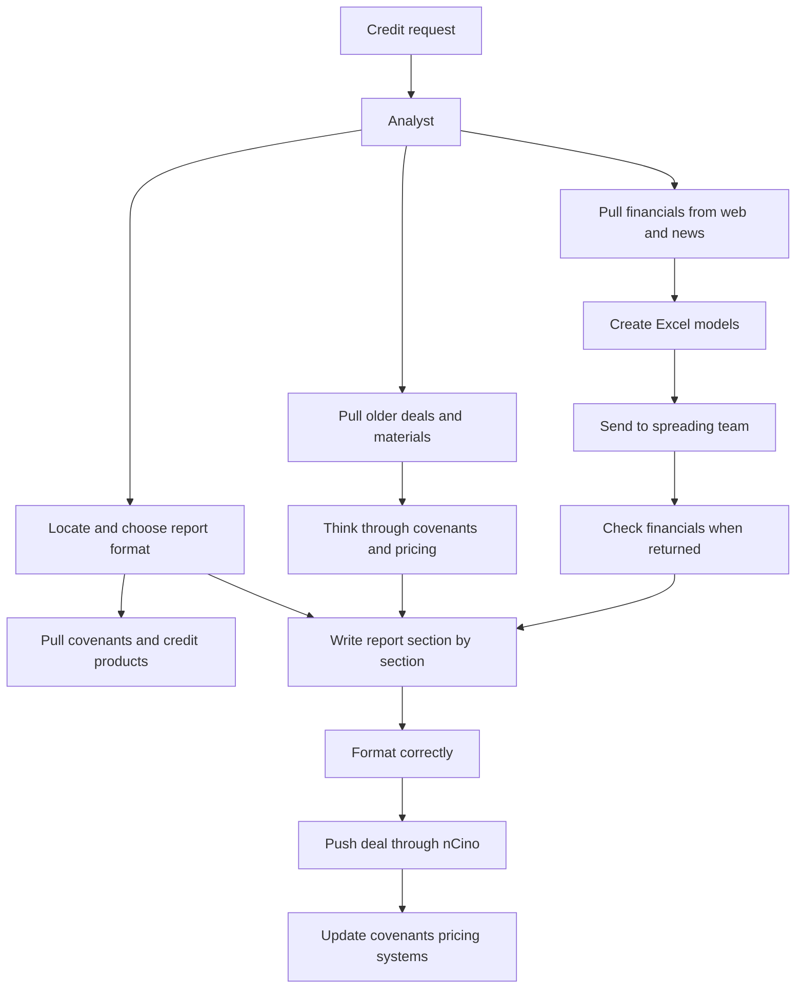
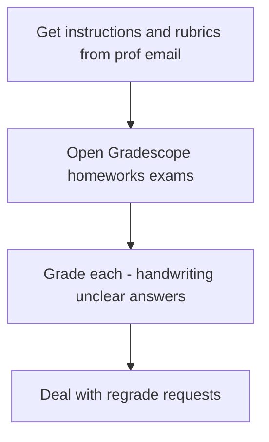

# Environment graphs — SwivelBench dual domains

Sketch-aligned workflows scored by deterministic SQL over two ATTACHed SQLite
databases. Agent runtime is a multi-turn tool loop (not an executable graph).

## Shared harness

## Commercial banking (`envs/commercial_banking`)

Systems: `credit_workbench` (A) + `ncino_core` (B). Tasks: `CB-*`.

Mess traps: corrupted templates, conflicting digests, spread injection,
archived customer duplicates, matured products, authority floor.

## Grading (`envs/grading`)

Systems: `inbox` (A) + `gradescope` (B). Tasks: `GR-*`.

Mess traps: conflicting/messy rubric emails, unclear answers, handwriting
noise, name-collision students, out-of-rubric regrade bait.

## Scoring

| Kind | Share |
|---|---:|
| positive | 20% |
| propagation | 30% |
| negative | 35% |
| trail | 15% |

Critical assertion failures cap `final` at `CRITICAL_CAP = 0.30` (benchmark).
Training mode may set the cap to `None`.

## Per-step grade inventory

Every graph step has **multiple** SQL facets (template + digest provenance +
spread linkage + report completeness, etc.). Canonical assert IDs and SQL
intents live in:

- `envs/commercial_banking/fixtures/assertions.sql` (CB-SEED-001)
- `envs/grading/fixtures/assertions.sql` (GR-SEED-001)

Live breakdown: canvas
`canvases/swivelbench-environment-overview.canvas.tsx`.

BTB inspiration (concepts only, no LLM judge): structural completeness, data
provenance, and model↔spread linkage from bankertoolbench judge-guidance —
encoded as dual-DB boolean SELECTs under `KIND_SHARE`.
